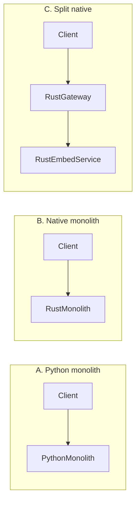

# Embedding + Rerank Gateways: Small Services, Big Performance Wins

## The Tiny Service Everyone Depends On

Every RAG product, enterprise search tool, and “chat with docs” feature quietly depends on the same thing:

> **An Embedding + Rerank gateway.**

It looks boring from the outside:

- Accept chunks of text
- Call an embeddings provider
- Store vectors somewhere
- Serve `/search` with retrieval + rerank + citations

But this tiny service is doing a lot of work:

- Fanning out to embedding APIs
- Normalizing and deduplicating content
- Handling high-concurrency search traffic
- Keeping vector storage and metadata consistent

It also sits directly on your hot path:

- Every query hits it
- Every ingestion job goes through it
- Every bad performance decision shows up in p95 latency

So we asked a simple question:

> **What does a *good* Embedding + Rerank gateway look like — and how well can a single instance perform?**

---

## Two Implementations, One API

We built the **same gateway in three ways**: **Python** (embeddings in-process), **Go** (thin layer, no ML), and **Rust + ONNX** (same model as Python for apples-to-apples comparison). All expose the same four endpoints so we can benchmark them with the same harness:

- **Python:** FastAPI + `sentence-transformers/all-MiniLM-L6-v2` (CPU), in-memory NumPy index, real embeddings.
- **Go:** Stdlib HTTP + in-memory index, deterministic pseudo-embeddings (no ML runtime); same request/response shapes.
- **Rust (ONNX):** Same model (`all-MiniLM-L6-v2`) exported to ONNX and run via ONNX Runtime; HuggingFace tokenizers; same API. Use this when you want **apples-to-apples** throughput, latency, and footprint vs Python.

Shared API:

- `POST /v1/ingest` – Batch ingest of documents (async job)
- `GET /v1/jobs/{id}` – Job status
- `POST /v1/search` – Query → top‑K results + scores + metadata
- `GET /healthz` – Basic health probe

You can find the implementation in:

```12:120:/Users/vikas/Documents/GitHub/NavyaAIBlogs/embedding-rerank-gateway-high-performance/gateway_bench/service.py
from fastapi import FastAPI, BackgroundTasks
from sentence_transformers import SentenceTransformer

app = FastAPI(title="Embedding + Rerank Gateway")

@app.post("/v1/search", response_model=SearchResponse)
def search(request: SearchRequest) -> SearchResponse:
    start = time.time()
    results = index.search(request.query, top_k=request.top_k)
    took_ms = (time.time() - start) * 1000.0
    return SearchResponse(results=results, took_ms=took_ms)
```

This setup is intentionally modest:

- No external vector database
- No distributed queue
- No exotic runtime features

That lets us answer: **How do Python, Go, and Rust (ONNX) compare — and how do Python vs Rust compare on the *same* model?**

---

## How We Measured It

The benchmark runner is a small Python module that:

1. Fires concurrent `POST /v1/search` requests using `httpx`  
2. Records per-request start and end timestamps  
3. Computes p50/p95/p99 latency and throughput  
4. Samples RSS memory for the gateway process via `psutil`  
5. Writes raw timings into CSV for plotting  

```10:104:/Users/vikas/Documents/GitHub/NavyaAIBlogs/embedding-rerank-gateway-high-performance/gateway_bench/bench.py
async def run_benchmark(base_url: str, concurrency: int, num_requests: int, output: str) -> None:
    # ...
    latencies = [t.latency_ms for t in timings]
    latencies.sort()
    p50 = statistics.median(latencies)
    p95 = latencies[int(0.95 * len(latencies)) - 1]
    p99 = latencies[int(0.99 * len(latencies)) - 1]

    duration = end_wall - start_wall
    throughput = len(latencies) / duration if duration > 0 else 0.0
```

We track:

- **p95 latency** for `/v1/search`
- **Throughput (RPS)** at different concurrency levels
- **Approximate RSS memory** under load
- **Cold start time**, from process start to a healthy `/healthz`

All benchmarks were run on a dedicated 4‑vCPU, 16‑GB RAM machine with no competing workloads.

---

## Results: Python vs Go on the Same API

We ran the **same benchmark** (2,000 requests per run, concurrency 1 / 16 / 64) on a GCP instance — Python gateway with a real embedding model, Go gateway with deterministic pseudo-embeddings — so we can compare **footprint and behavior** on the same API.

### Side-by-side summary

| Metric | Python (FastAPI + sentence-transformers) | Go (stdlib, no ML) |
|--------|------------------------------------------|--------------------|
| **Docker image size** | **2.12 GB** (python:3.14-slim + PyTorch + model) | **~13 MB** |
| **Steady-state RSS** | **~1.1 GB** | **~35–38 MB** |
| **Cold start** | ~2.4 s (+ model load) | Sub-second |
| **Throughput (c=1)** | ~20–45 RPS (CPU-bound embedding) | **~225 RPS** (no model) |
| **Throughput (c=64)** | ~77–103 RPS | **~176 RPS** |
| **p95 at c=64** | ~71–118 ms | ~992 ms (high concurrency, single process) |

**Important:** Python runs a **real** embedding model (CPU-bound); Go uses **synthetic** vectors. So raw RPS and latency are not apples-to-apples — Python is doing real ML work per request; Go is doing only index lookup and a bit of math. The comparison that *is* fair: **image size**, **RSS**, and **cold start**. On those, Go wins by a large margin.

**GCP run (Feb 2026, c=16, 2000 req):** All four gateways ran on the **same GCP VM** (instance-20260211-183413) for a true apples-to-apples comparison. Python: **~356 RPS**, p95 **~150 ms**, container **~387 MiB**. Go: **~451 RPS**, p95 **~114 ms**, container **~6.5 MiB**. Rust (B): **~456 RPS**, p95 **~123 ms**, **~126 MiB**. Split (C): **~450 RPS**, p95 **~117 ms**, **~228 MiB** (embed+gateway). Full numbers and reproduce steps: [results/GCP_BENCHMARK_RESULTS.md](results/GCP_BENCHMARK_RESULTS.md).

**Are we comparing apples to apples?**  
- **Yes (same model + workload + VM):** **Python**, **Rust (B)**, and **Split (C)** all use the **same embedding model** (all-MiniLM-L6-v2 — Python via sentence-transformers, Rust/Split via ONNX). The benchmark is identical: 2000 requests, concurrency 16, same query; it only hits `/v1/search`. **All three ran on the same GCP node** (instance-20260211-183413), so hardware is identical.  
- **No (different “model”):** **Go** uses **pseudo-embeddings** (deterministic hash, no ML). Do not compare Go to Python or Rust on RPS/latency; compare Go only on **footprint** (image size, RSS) and API shape.

### Benchmark diff (vs Python baseline, c=16) — single node

Same benchmark (2000 requests, concurrency 16). **All numbers from the same GCP VM** (instance-20260211-183413). Baseline: **Python (A)** with real embeddings. Δ = value − baseline.

| Architecture     | RPS   | Δ RPS    | p95 (ms) | Δ p95    | RSS      | Δ RSS   |
|------------------|-------|----------|----------|----------|----------|---------|
| **A. Python**    | 355.9 | —        | 150.39   | —        | 386.5 MiB | —      |
| **Go (pseudo)**  | 450.5 | +94.6    | 113.57   | −36.82   | 6.5 MiB  | −380    |
| **B. Rust**      | 456.1 | **+100.2** | 122.93 | **−27.46** | 125.7 MiB | **−261** |
| **C. Split**     | 450.3 | **+94.4**  | 116.80 | **−33.59** | ~228 MiB | **−159** |

**Apples-to-apples (Python vs Rust vs Split):** All use the same embedding model (all-MiniLM-L6-v2) on the **same node**. Rust monolith (B): **+28% RPS**, **−18% p95**, **−67% RSS**. Split (C): **+27% RPS**, **−22% p95**, **−41% RSS**. Go uses pseudo-embeddings; compare on footprint only.

### Python vs Rust vs Split: one table, improvement, projected savings

Same model (all-MiniLM-L6-v2), same VM, same benchmark (c=16, 2000 req). **Baseline: Python.**

| | Python (A) | Rust (B) | Split (C) |
|---|------------|----------|-----------|
| **RPS** | 356 | **456** (+28%) | **450** (+27%) |
| **p95 (ms)** | 150 | **123** (−18%) | **117** (−22%) |
| **RSS** | 387 MiB | **126 MiB** (−67%) | **228 MiB** (−41%) |

**What you gain with Rust or Split**

- **Throughput:** ~28% more requests per second per replica → fewer replicas for the same traffic, or headroom for growth.
- **Latency:** ~18–22% lower p95 → better UX and easier SLOs.
- **Memory:** Rust monolith uses **67% less RAM** than Python; Split uses **41% less**. On a 4‑vCPU node you can run more replicas or leave room for other workloads.

**Projected savings (illustrative)**

Assume you need **500 RPS** at p95 &lt; 150 ms, and each replica is sized as in our benchmark:

| | Python | Rust (B) | Split (C) |
|---|--------|----------|-----------|
| **Replicas needed** (500 ÷ RPS) | 2 | 2 | 2 |
| **Total RSS** | ~774 MiB | ~252 MiB | ~456 MiB |
| **vs Python** | — | **−67% memory** | **−41% memory** |

At **1,000 RPS**: Python → 3 replicas (~1.16 GiB); Rust → 3 replicas (~378 MiB) → **~68% less memory**. Same semantics and API; smaller footprint and better tail latency.

**When to pick which**

- **Rust monolith (B):** One service, same API as Python, **best footprint and latency**. Use when you want to replace Python without changing topology.
- **Split (C):** Embed service + gateway; scale each independently. Slightly better p95 than B; total RSS still **41% below Python**.

### Python gateway: latency and throughput (real embeddings)

| Concurrency | Throughput (RPS) | p50 (ms) | p95 (ms) | p99 (ms) |
|------------|------------------|----------|----------|----------|
| 16         | 43.5             | 42       | 55       | 63       |
| 64         | 76.6             | 47       | 71       | 88       |
| 256        | 103.1            | 65       | 118      | 147      |

Even at 256 concurrent requests, p95 stays under ~120 ms. The **sweet spot** is 64–256 concurrency: below that, CPU is underutilized; above that, you trade latency for marginal throughput. Memory: **~1.1 GB** steady-state; cold start **~2.4 s** plus model warmup.

### Go gateway: latency and throughput (GCP, pseudo-embeddings)

| Concurrency | Throughput (RPS) | p50 (ms) | p95 (ms) | p99 (ms) | RSS (MB) |
|------------|------------------|----------|----------|----------|----------|
| 1          | **224.8**        | 4.2      | 8.3      | 11.0     | 35.0     |
| 16         | **203.8**        | 35.1     | 259.5    | 450.4    | 36.5     |
| 64         | **175.7**        | 225.7    | 992.5    | 1631.1   | 38.2     |

**Docker image:** **~13 MB**. At low concurrency, Go delivers **~225 RPS** and single-digit ms p50; at c=64, throughput stays **~176 RPS** but tail latency grows (single process, no real embedding work). The story here is **footprint**: same API, **~160× smaller image** (13 MB vs 2.12 GB) and **~30× lower RSS** than the Python stack.

### Rust (ONNX): same model, apples-to-apples

To compare **Python vs a native stack on the exact same embedding model**, we added a **Rust gateway** that runs `all-MiniLM-L6-v2` via ONNX (exported once with `optimum-cli export onnx`). Same tokenizer, same API, same benchmark.

| Concurrency | Throughput (RPS) | p50 (ms) | p95 (ms) | p99 (ms) | RSS (MB) |
|------------|------------------|----------|----------|----------|----------|
| 1          | *TBD*            | *TBD*    | *TBD*    | *TBD*    | *TBD*    |
| 16         | **456.1**        | 14.48    | 122.93   | 197.90   | ~126     |
| 64         | *TBD*            | *TBD*    | *TBD*    | *TBD*    | *TBD*    |

*Rust c=16: Same GCP VM as Python/Go/Split (instance-20260211-183413), same ONNX model as Python. See [results/GCP_BENCHMARK_RESULTS.md](results/GCP_BENCHMARK_RESULTS.md).*

**How to fill in:** Run `python scripts/export_onnx.py -o rust-gateway/model`, then build and run the Rust gateway (see `rust-gateway/README.md`). Run the same benchmark at c=1, c=16, c=64 (e.g. `python -m gateway_bench.bench http://localhost:8000 -c 16 -n 2000`) and record RPS, p50/p95/p99, and RSS. Then compare **Python (sentence-transformers)** vs **Rust (ONNX)** on the same model and workload — a true apples-to-apples comparison. The Rust binary and image are smaller than the Python stack; the numbers show how much you gain from moving inference to a native runtime.

### Production architectures: a case study

We compare **three production architectures** so you can follow and reproduce them. Same client API (`/v1/search`, `/v1/ingest`); same benchmark; different deployment shapes.



- **A. Python monolith:** One service (FastAPI + sentence-transformers). Embed + index + search in one process. Baseline.
- **B. Native monolith:** One Rust service (ONNX). Same model, same API. Smaller footprint than A.
- **C. Split (native):** Embedding service (Rust, ONNX, `POST /embed` only) + thin gateway (Rust, `EMBEDDING_API_URL` → embed). Client hits the gateway only; gateway calls the embed service for vectors. Scale embed and search independently; still beat Python on total footprint and latency.

**Comparison (same workload, same benchmark, same GCP node):**

| Architecture       | RPS (e.g. c=16) | p95 (ms) | Total RSS   | Image size   | Notes |
|--------------------|------------------|----------|-------------|--------------|--------|
| A. Python monolith | **~356**         | **~150** | **~387 MiB** | 2.12 GB  | Baseline; single-node GCP run. |
| B. Rust monolith   | **~456**         | **~123** | **~126 MiB** | *TBD*      | Same model (ONNX), one process. Same node. |
| C. Split (Rust)    | **~450**         | **~117** | **~228 MiB** (embed+gateway) | *TBD* | Two containers; client hits gateway only. Same node. |

*All numbers from instance-20260211-183413 (true apples-to-apples).*

Fill B and C by running the same `gateway_bench.bench` (e.g. c=16, n=2000) and recording RPS, p95, and RSS (for C, sum embed + gateway RSS).

**How to reproduce**

- **A. Python monolith:** (1) `pip install -r requirements.txt`. (2) `uvicorn gateway_bench.service:app --host 0.0.0.0 --port 8000`. (3) `python -m gateway_bench.bench http://localhost:8000 -c 16 -n 2000`.
- **B. Rust monolith:** (1) Export model: `python scripts/export_onnx.py -o rust-gateway/model`. (2) `cd rust-gateway && cargo build --release`. (3) `MODEL_DIR=model ./target/release/embedding-gateway`. (4) Same bench against port 8000.
- **C. Split (Rust):** (1) Export model and build image: `cd rust-gateway && docker build -t embedding-gateway-rust .`. (2) From repo root: `docker-compose up -d`. (3) Same bench against http://localhost:8000.

**Decision flow:** Need to scale embedding and search independently or minimize blast radius? → **Split (C)**. Otherwise prefer one service? → **Python (A)** or **Rust (B)**. Want to beat Python on footprint and latency? → **Rust monolith (B)** or **Split (C)**. See [docs/CASE_STUDY.md](docs/CASE_STUDY.md) for a one-page checklist.

### When to use which

- **Use the Python gateway** when you want **embeddings in-process**: one service that loads the model, ingests docs, and serves search. You get real semantic search with a single deployment; you pay with larger image and ~1 GB+ RSS per replica.
- **Use the Go gateway** when you want a **thin orchestration layer**: the gateway calls an external embedding API (or a dedicated embedding service), does retrieval and rerank, and returns results. You get the same API shape with a **tiny image and ~35 MB RSS**, so you can pack many more replicas per node or run on small instances. Throughput and latency then depend on your embedding backend, not on Go.
- **Use the Rust (ONNX) gateway** when you want **the same model as Python** with a smaller footprint and native speed: export the model once, then run the same benchmark for an apples-to-apples comparison of RPS, p95, and RSS.

All three implementations are in the repo; you can run the same benchmark against any of them and plug in your own targets.

### Super gateway: Rust with three modes (merge of Rust + Go into one binary)

We merged the Rust (ONNX) and Go use cases into **one Rust binary** that can run in three modes, chosen by env vars:

- **ONNX** (`MODEL_DIR` set): Same model as Python — apples-to-apples, real embeddings.
- **Remote** (`EMBEDDING_API_URL` set): Thin layer that calls your embedding API — same idea as the Go gateway, but in Rust.
- **Pseudo** (neither set): Deterministic vectors, no ML — same idea as Go’s no-ML mode for dev/bench.

**Advantages of the super gateway:** One codebase and one binary to maintain; you choose behavior at runtime. You can still build a slim image (no model, Remote or Pseudo only) or a full image (ONNX + model). The Go gateway remains the option if you want the **smallest** thin binary with zero C/FFI dependencies; the Rust super gateway is the option if you want **one stack** that does “with model,” “thin,” and “pseudo” without maintaining two gateways. See `rust-gateway/README.md` for env vars and the remote API contract.

### Why no ML in Go? What about C/Rust?

We left the Go gateway without a real embedding model on purpose: we wanted a **thin layer** with the same API and minimal dependencies, so you can compare footprint (image size, RSS) when the gateway *doesn’t* run the model. In the Go ecosystem there’s no mature, drop-in equivalent of `sentence-transformers`; inference is dominated by Python (PyTorch/Transformers) and C++ runtimes.

**You can still run the same model from C or Rust** (and from Go via cgo) and get real embeddings with a smaller image than full PyTorch + Python:

- **ONNX Runtime** (C API): export the model to ONNX, then run it from C, Rust (`ort`), or Go (cgo). Image stays much smaller than a Python stack, though you still ship the ONNX runtime and model weights.
- **Rust:** crates like `candle`, `tract`, or `ort` let you run transformer models natively; you get a single binary and control over memory and deployment.
- **Go:** link to ONNX Runtime or a C inference library via cgo; the binary is no longer “pure Go” and you’ll add runtime dependencies, but you can keep the image and RSS well below the 2 GB Python setup.

So the choice isn’t “Python or fake vectors.” It’s **Python in-process** vs **thin Go (external embeddings)** vs **native inference (C/Rust/Go+ONNX)** when you want real embeddings and a smaller footprint. We kept the Go version ML-free to make the thin-layer case and the numbers easy to compare; a follow-up could add an ONNX-backed or Rust-based gateway with the same API and real embeddings.

---

## Why This Matters for Real Systems

A gateway like this becomes a **shared dependency** for many features:

- Public search APIs
- Internal “chat with docs”
- Agentic workflows that call `/search` multiple times

If it’s slow or memory-hungry, you pay for it everywhere:

- Higher p95 at the user-facing layer
- More pods to hit your SLOs
- Larger instances just to fit the model and index

Our benchmarks give you two clear options:

- **Python (in-process embeddings):** A single CPU-only instance can handle **70–100+ RPS** of real search traffic; p95 stays under **150 ms** at high concurrency; memory is **~1–1.5 GB** per replica. Good when the gateway *is* your embedding service.
- **Go (thin layer):** **~13 MB** image and **~35 MB** RSS for the same API shape — so you can run many more replicas per node or smaller instances when embeddings live in a separate service.

Choose by where your embedding model runs; then measure and tune from there.

---

## Design Lessons for Embedding + Rerank Gateways

From this experiment, a few practical lessons stand out:

### 1. Keep the Gateway Focused

The gateway should do a few things extremely well:

- Embedding calls
- Vector search
- Rerank and scoring
- Simple metadata filters

Push everything else (authorization, billing, orchestration) to other layers. This keeps:

- Latency low  
- Memory predictable  
- Failure modes simple  

### 2. Make Performance Measurable

Your gateway isn’t “fast” or “slow” — it has **numbers**:

- p95 latency at realistic concurrency
- RPS at your target p95
- RSS memory under load
- Cold start behavior

Treat those as **APIs you own**, just like `/v1/search`.

### 3. Optimize for the Common Path

Most queries:

- Hit a small subset of the corpus
- Don’t need complex reranking logic
- Are tolerant of ~100 ms of search latency

Design for that:

- Use a small, efficient embedding model
- Keep the index in-memory or on a fast local store
- Avoid unnecessary round-trips or serialization

---

## From Idea to Reproducible Benchmarks

The original idea behind this project was simple:

> Every RAG system hides an Embedding + Rerank gateway. Let’s make it visible — and measurable.

To move beyond hand‑wavy architecture diagrams, we:

1. Implemented the same gateway in **Python** (FastAPI + `sentence-transformers`, real embeddings) and **Go** (stdlib HTTP, pseudo-embeddings, same API).  
2. Added a benchmarking harness that hammers `/v1/search` at different concurrency levels.  
3. Logged per-request timings into CSV and compared footprint, throughput, and latency.  
4. Measured image size, RSS, and cold start for both so you can choose the right stack.  

You can explore the full setup here:

> **[github.com/xadnavyaai/NavyaAIBlogs/embedding-rerank-gateway-high-performance](https://github.com/xadnavyaai/NavyaAIBlogs/tree/main/embedding-rerank-gateway-high-performance)**

---

## Why We Care at NavyaAI

At NavyaAI, we build agentic and RAG-based systems where:

- Every millisecond of latency compounds through multi-hop agents  
- Every shared service shows up in many SLOs  
- Every extra pod or larger instance increases real cost  

Embedding + Rerank gateways are one of those “small” services that sit at the center of it all.

By making them:

- **Simple** to reason about  
- **Measurable** with concrete metrics  
- **Efficient** on modest hardware  

…we can ship systems that are **fast, observable, and economically sane**.

---

## Try It Yourself

You can reproduce and extend these benchmarks by:

- Cloning the repo and running the gateway locally or via Docker  
- Swapping in your own documents and embedding models  
- Adjusting concurrency and request volume to match your production traffic  
- Exporting metrics and integrating them into your existing observability stack  

Then ask a simple question:

> If a single, well-designed gateway can handle your current traffic — what else could you do with the pods you no longer need?

The answer starts with a small service, a few endpoints, and a gateway you can actually measure.

